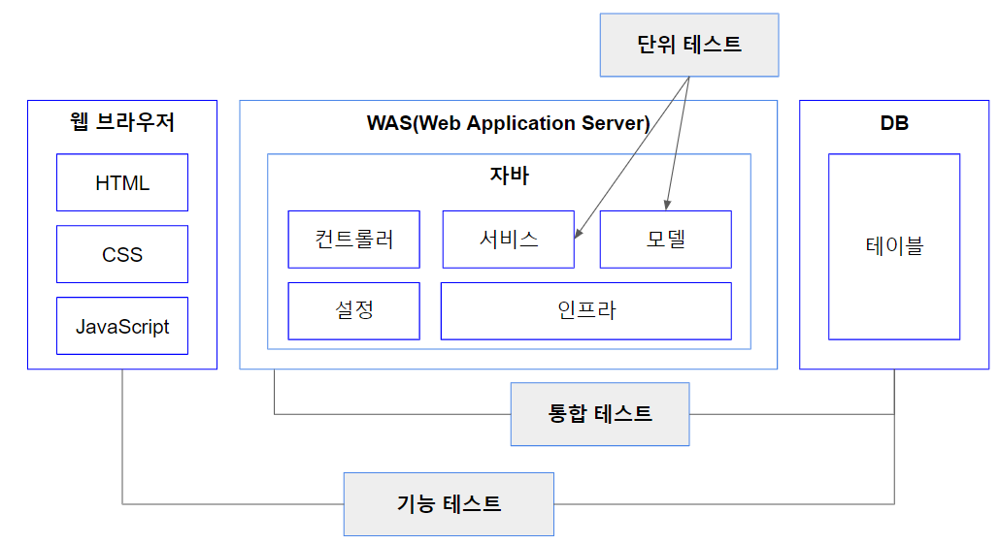

# Test Guide

스프링에 대한 공부를 하면 할수록 테스트 코드에 대한 중요성을 알게되었다. 블로그나 인강을 통해서 테스트 코드에 대한 내용을 보고 들었고, 직접 구현도 해봤지만 제대로된 공부를 해본적이 없었다. 테스트 방법에는
여러가지가 존재하고 각각의 테스트 방법은 장점과 단점들이 있다. 이에 대해서 알아보고 어느 상황에 어떤 테스트 방법을 사용할지에 정리해보자.

## 테스트 대역(Test Double)
외부 의존 구성요소를 사용할 수 없거나 직접 사용하고 싶지 않을 때, 테스트 대상 코드와 대신해서 상호작용하는 객체를 말한다.

> 단위 테스트(Unit Test) < 통합 테스트(Integration Test) < 기능 테스트(Functional Test)




### 1. 통합 테스트
통합테스트는 테스트하고자 하는 코드가 각 모듈들의 상호 작용이 제대로 이루어지는지 검증하는 테스트이다.

#### 장점
- 스프링부트 컨테이너를 동작시켜 테스트하기 때문에 운영환경과 가장 유사한 테스트가 가능하다.
- 전체적인 Flow 를 쉽게 테스트 할 수 있다.

#### 단점
- 애플리케이션의 설정 및 모든 Bean 을 로드하기 때문에 시간이 오래걸리고 무겁다.
- 테스트 단위가 커 디버깅이 어렵다.
- 외부 API 콜같은 Rollback 처리가 안되는 테스트는 진행하기 어렵다.

#### Code

IntegrationTest :point_right: [source 보기](https://github.com/heechul90/study-spring-guide/blob/main/src/test/java/com/spring/guide/test/IntegrationTest.java)
```java
@SpringBootTest(webEnvironment = SpringBootTest.WebEnvironment.RANDOM_PORT)
@AutoConfigureMockMvc
@AutoConfigureTestDatabase(replace = AutoConfigureTestDatabase.Replace.ANY)
@AutoConfigureRestDocs
@ActiveProfiles("test")
@Transactional
public class IntegrationTest {

  @PersistenceContext protected EntityManager em;
  @Autowired protected MockMvc mockMvc;
  @Autowired protected ObjectMapper objectMapper;
}
```
- 통합테스트의 Base 클래스
- Controller Layer 를 주로 테스트 합니다.
- @SpringBootTest 어노테이션을 통해 통합 테스트를 위한 환경을 준비합니다.
- @AutoConfigureMockMvc 어노테이션을 통해 @Service나 @Repository가 붙은 객체들도 메모리에 올립니다.
- @AutoConfigureTestDatabase 어노테이션을 통해 데이터베이스 설정을 변경합니다.
- @AutoConfigureRestDocs 어노테이션을 통해 Rest Docs를 설정합니다.(여기서는 사용하지 않습니다.)
- @ActiveProfiles 어노테이션을 통해 테스트 프로파일을 설정합니다.
- @Transactional 어노테이션을 통해 테스트코드의 데이터베이스 정보가 자동으로 Rollback 됩니다.
- @PersistenceContext 어노테이션을 통해 EntityManager를 주입받습니다.


UserControllerTest  :point_right: [source 보기](https://github.com/heechul90/study-spring-guide/blob/main/src/test/java/com/spring/guide/core/user/controller/UserControllerTest.java)
```java
class UserControllerTest extends IntegrationTest {
    
    @Autowired protected UserService userService;

    private User user;

    @BeforeEach
    void beforeEach() {
        user = UserSetup.build();
    }

    @Test
    @DisplayName("user 단건 조회")
    void findUser() throws Exception {
        //given
        em.persist(user);

        //when
        ResultActions resultActions = mockMvc.perform(get("/api/v1/users/{userId}", user.getId()));

        //then
        resultActions
                .andExpect(status().isOk())
                .andExpect(jsonPath("$.transaction_time").isNotEmpty())
                .andExpect(jsonPath("$.message").value(JsonCode.SUCCESS.name()))
                .andExpect(jsonPath("$.status").value(JsonCode.SUCCESS.getStatus()))
                .andExpect(jsonPath("$.code").value(JsonCode.SUCCESS.getCode()))
                .andExpect(jsonPath("$.data.userId").value(user.getId()))
                .andExpect(jsonPath("$.data.loginId").value(user.getLoginId()))
                .andExpect(jsonPath("$.data.password").value(user.getPassword()))
                .andExpect(jsonPath("$.data.userName").value(user.getName()))
                .andExpect(jsonPath("$.data.userEmail").value(user.getEmail()))
                .andDo(print());
    }
}
```
- IntegrationTest 클래스를 상속받아 통일성을 높힙니다.
- @Autowired 어노테이션을 통해 필요한 객체를 주입받습니다.
- @BeforeEach 어노테이션을 통해 @Test 를 실행하기 전에 매번 실행하여 값을 세팅합니다.
- @Nested 어노테이션을 통해 비슷한 관심사끼리 그룹화해주고 중첩 클래스를 이용해 계층적으로 테스트를 작성할 수 있습니다.
- @DisplayName 어노테이션을 통해 테스트 클래스 혹은 테스트 메서드의 이름을 지정할 수 있습니다.
- Given-When-Then 패턴으로 Test Code 를 작성한다.
  - Given : 테스트에 사용할 User 를 EntityManager 를 통해 영속성 컨텍스트를 준비한다.
  - When : MockMvcRequestBuilders 클래스를 사용하여 실제로 테스트를 실행한다.
  - Then : MockMvcResultMatchers 클래스를 사용하여 테스트를 검증한다.

### 2. 단위 테스트
단위테스트는 소스 코드의 독립된 특정 모듈을 개별적으로 검증하는 테스트이다.

#### 장점
- 테스트 시간 단축으로 문제점 발견 가능성이 높아지고 안정성이 향상된다.
- 테스트 간 결합도가 낮으므로 간단해진다.

#### 단점
- 의존성 있는 객체를 Mocking 하기 때문에 완결한 테스트가 아니다.

#### Code

MockTest :point_right: [source 보기](https://github.com/heechul90/study-spring-guide/blob/main/src/test/java/com/spring/guide/test/MockTest.java)
```java
@ExtendWith(MockitoExtension.class)
@ActiveProfiles(profiles = "test")
public class MockTest {
    
}
```
- 단위 테스트의 Base 클래스
- Service Layer 를 주로 테스트 합니다.
- MockitoExtension 을 통해 Mock 테스트를 합니다.


UserServiceTest  :point_right: [source 보기](https://github.com/heechul90/study-spring-guide/blob/main/src/test/java/com/spring/guide/core/user/service/UserServiceTest.java)
```java
class UserServiceTest extends MockTest {

    @InjectMocks protected UserService userService;
    @Mock protected UserQueryRepository userQueryRepository;
    @Mock protected UserRepository userRepository;

    private User user;

    @BeforeEach
    void beforeEach() {
        user = UserSetup.build();
    }

    @Nested
    @DisplayName("성공 테스트")
    class SuccessfulTest {

        @Test
        @DisplayName("user 단건 조회")
        void findUser() {
            //given
            given(userRepository.findById(any(Long.class))).willReturn(Optional.ofNullable(user));

            //when
            User findUser = userService.findUser(UserSetup.userId());

            //then
            assertThat(findUser.getLoginId()).isEqualTo(user.getLoginId());
            assertThat(findUser.getPassword()).isEqualTo(user.getPassword());
            assertThat(findUser.getName()).isEqualTo(user.getName());
            assertThat(findUser.getEmail()).isEqualTo(user.getEmail());

            //verify
            verify(userRepository, times(1)).findById(any(Long.class));
        }
    }

    @Nested
    @DisplayName("예외 발생 테스트")
    class ExceptionTest {

        @Test
        @DisplayName("user 단건 조회_예외")
        void findUser_userNotFound() {
            //given
            given(userRepository.findById(any(Long.class))).willThrow(new UserNotFound());

            //expected
            assertThatThrownBy(() -> userService.findUser(UserSetup.userNotFoundId()))
                    .isInstanceOf(UserNotFound.class)
                    .hasMessage(UserSetup.userNotFoundMessage());
        }
    }
}
```
- MockTest 클래스를 상속받아 통일성을 높힙니다.
- @InjectMocks 어노테이션을 통해 Mocking 한 객체를 주입받아 테스트할 서비스의 메서드를 실행합니다.
- @Mock 어노테이션을 통해 Mocking 할 객체를 선언합니다.
- @BeforeEach 어노테이션을 통해 @Test 를 실행하기 전에 매번 실행하여 값을 세팅합니다.
- @Nested 어노테이션을 통해 비슷한 관심사끼리 그룹화해주고 중첩 클래스를 이용해 계층적으로 테스트를 작성할 수 있습니다.
- @DisplayName 어노테이션을 통해 테스트 클래스 혹은 테스트 메서드의 이름을 지정할 수 있습니다.
- Given-When-Then 패턴으로 Test Code 를 작성한다.
  - Given : BDD(Behavior-Driven Development) 행위 주도 개발 방식인 BDDMockito 클래스의 given().willReturn(), given().willThrow() 메서드를 사용해 테스트 데이터를 준비합니다.
  - When : 주입받은 Service 를 실행합니다.
  - Then : Assertion.assertj 클래스를 통해 테스트를 검증합니다.


### 3. 레포지토리 테스트
jpa 관련된 설정들만 로드하여 검증하는 테스트입니다.

#### 장점
- Repository 관련된 Bean 들만 등록하기 때문에 통합 테스트에 비해서 빠릅니다.

#### 단점
- 테스트 범위가 작기 때문에 실제 환경과 차이가 발생합니다.

#### Code

RepositoryTest  :point_right: [source 보기](https://github.com/heechul90/study-spring-guide/blob/main/src/test/java/com/spring/guide/test/RepositoryTest.java)
```java
@DataJpaTest
@AutoConfigureTestDatabase(replace = AutoConfigureTestDatabase.Replace.ANY)
@ActiveProfiles("test")
public class RepositoryTest {

    @PersistenceContext protected EntityManager em;
}
```
- @DataJpaTest 어노테이션을 통해
- @AutoConfigureTestDatabase

UserRepositoryTest  :point_right: [source 보기](https://github.com/heechul90/study-spring-guide/blob/main/src/test/java/com/spring/guide/core/user/repository/UserRepositoryTest.java)
```java
@Import(UserTestConfig.class)
class UserRepositoryTest extends RepositoryTest {

    @Autowired protected UserQueryRepository userQueryRepository;
    @Autowired protected UserRepository userRepository;

    @Nested
    @DisplayName("user 레포지토리 성공 테스트")
    class SuccessfulTest {

        @Test
        @DisplayName("user 목록 조회")
        void findUsers() {
            //given
            List<User> users = UserSetup.usersBuild();
            userRepository.saveAll(users);

            UserSearchCondition condition = UserSetup.userSearchConditionBuild();
            PageRequest pageRequest = UserSetup.pageRequestBuild();

            //when
            Page<User> content = userQueryRepository.findUsers(condition, pageRequest);

            //then
            assertThat(content.getTotalElements()).isEqualTo(10);
            assertThat(content.getContent().size()).isEqualTo(10);
        }
    }
}
```
- @Import 어노테이션을 통해 필요한 클래스를 Bean 으로 등록합니다.
- @Autowired 어노테이션을 통해 UserQueryRepository 와 UserRepository 클래스를 주입 받습니다.
- @Nested 어노테이션을 통해 중첩된 구조로 테스트를 구정합니다.
- Given-When-Then 패턴으로 Test Code 를 작성합니다.
  - Given : EntityManager 나 Repository 를 통해서 데이터를 데이터베이스에 준비시킵니다.
  - When : UserQueryRepository 또는 UserRepository 주입받아 실제로 테스트를 실행합니다.
  - Then : Assertion.assertj 클래스를 통해 테스트를 검증합니다.